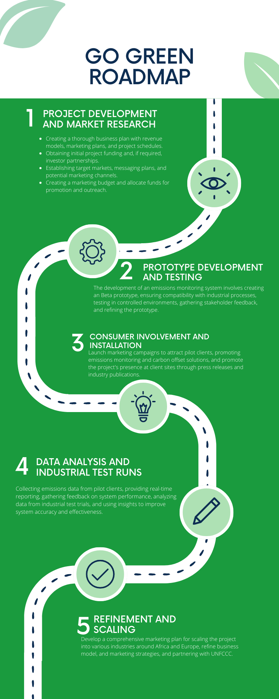

 

# Go Green KE
  

- [Project summary](#project-summary)

- [The issue we are hoping to solve](#the-issue-we-are-hoping-to-solve)

- [How our technology solution can help](#how-our-technology-solution-can-help)

- [Our idea](#our-idea)

- [Technology implementation](#technology-implementation)

- [IBM AI service(s) used](#ibm-ai-services-used)

- [Other IBM technology used](#other-ibm-technology-used)

- [Solution architecture](#solution-architecture)

- [Presentation materials](#presentation-materials)

- [Solution demo video](#solution-demo-video)

- [Project development roadmap](#project-development-roadmap)

- [Additional details](#additional-details)

- [How to run the project](#how-to-run-the-project)

- [Live demo](#live-demo)

- [About this template](#about-this-template)

- [Contributing](#contributing)

- [Versioning](#versioning)

- [Authors](#authors)

- [License](#license)

- [Acknowledgments](#acknowledgments)

  

  

## Project summary

  

### The issue we are hoping to solve

Industrial processes heavily contribute towards climate change, accountable for nearly 25% all global emissions. However, tracking of greenhouse gases (GHGs) emissions in these firms is still **slow**, **complicated,** and **inaccurate**. 
 
### How our technology solution can help

  
Go-Green automates emissions tracking for factories and connects them with carbon offsetting initiatives.

### Our idea

Brief overview of solutions:

Industrial-sector organisations are in need of a simple and cost-effective solution to help them monitor and reduce their emissions. This is aided by increasing calls by individuals, institutions, and governments across the globe to reduce the amount of GHGs we emit into the atmosphere.

Answering the call to reduce emissions, industrial firms in Kenya and abroad have hired consulting firms who manually go through piles of receipts to tally emissions. This process is slow and can lead to inaccurate results. Moreover, the calculation methods used are often not standardized across organisations, leading to massive discrepancies in emissions reported as cited by the [UN](https://www.washingtonpost.com/climate-environment/interactive/2021/greenhouse-gas-emissions-pledges-data/).

Trust is another hurdle these firms must face, particularly when to comes to offsetting. It is noted that over [41%](https://www.businesswire.com/news/home/20230117005064/en/41-of-Businesses-Avoid-Carbon-Offsets-Due-to-Trust-Issues-Despite-Critical-Net-Zero-Role-%E2%80%93-AiDash) of Chief Sustainability Officers (CSOs) don’t use carbon offsetting due to a lack of trust in these programs’ ability to reduce their emissions fully and properly.

Important to note, reduction in emissions is also aided by a culture of sustainability within firms. Organisations often lack proper incentive structures for employees to lead more sustainable lifestyles. Noting these factors, GoGreen believes that current systems of reporting and reducing emissions need to be re-thought.

Our solution helps factories manage their CO2 emissions by equipping them with a platform that automates emissions recording. We then connect them to **vetted** carbon-offsetting initiatives which they can track the progress of on our Progress Tracker page. Furthermore, our platform provides these firms with the ability to extract emissions data from utility and equipment bills by uploading them from the main [dashboard](./gogreenreact/src/Dash.js). This ability is facilitated by the use of IBM’s Watson Discovery to extract relevant text from receipts that is passed onto a [foundational language model (LLAMA 2)](./ML/Llama2%20API.ipynb) for concise metric extraction. Through [Retrieval Augment Generation](https://research.ibm.com/blog/retrieval-augmented-generation-RAG), we can pass key information from the receipt to [ClimatiQ](https://www.climatiq.io/docs/guides/tutorials/quickstart#request), which returns the emissions factor of a material. From this. we can derive the equivalent CO2 emissions.

To obtain even more accurate recordings of Scope 1/direct emissions, we aim to equip factories with our custom low-cost GHG sensors. Their data is stored in a Cloudant Database which is periodically queried by an LSTM Neural Network deployed on Watson Machine Learning to forecast future demand - **solely on emission trends**. The results of which are shown in the RT-Readings page and Dashboard.

The fully built sensor will utilise professional grade **STM32** kits (not ESP32) for better ADC conversion at the edge to increase accuracy and integrate this with laser-based in-situ GHG monitoring devices.

To add onto the carbon-offsetting ecosystem of products, our platform seeks to use the hectares of untilitised land across Kenya - and the globe – by having a marketplace for individuals to lease unitilised land to carbon offsetting projects in need a place to carry out their activities.

Our system also incorporates an employee feed to reduce emissions, in hopes of incentivizing shifts to more sustainable cultures within organizations; seeking to impact not only on the organization level, but also on the personal level.

In sum, our solution aims to make the process of carbon accounting seamless, accurate, and inexpensive using IBM Cloud and IBM Watson services.
  

More detail is available in our [description document](./docs/DESCRIPTION.md).

  

## Technology implementation

  

### IBM AI service(s) used

  

- [Watson Discovery](./gogreenreact/src/cfuncs/InfoExtraction.js) – Used to extract emissions data from receipts. An API call to a discovery project is made from a Cloud Function that is triggered whenever a receipt is added to the Cloud Object Store. The resulting natural language query passage text is then fed into a Llama 2 model for concise data extraction. This is then fed to Climatiq for emission factor determination.

- [Watson Machine Learning](./ML/Predict_co2_emissions.ipynb)  - Used to deploy an LSTM Neural Network TensorFlow model for CO2 emission perdition. Due to a high correlation between factory emission and product demand, the resulting emission extrapolation helps factories forecast future demand and mange supply chain better.

  

### Other IBM technology used

- [IBM Cloud Object Storage](./gogreenreact/src/Dash.js) – Receipts are uploaded to a bucket in IBM’s Cloud Object Storage which itself is also linked to a Watson Discovery project for rapid emission data derivation.

- [IBM Cloudant](./gogreenreact/src/Barchart.js)  - Used to store majority of data displayed on the dashboard from the bar chart’s emissions breakdown to the progress tracker data. This is further integrated with Watson Machine Learning through Cloud Functions to store LSTM perdition and long term storage of incoming sensor data.

- [IBM Cloud Functions](./post_mq135/post_mq135.ino)  - Use to integrate different IBM services together, facilitate visualisation of data stored in Cloudant on the react Dashboard, and make external API calls.
  

### Solution architecture

  

Diagram and step-by-step description of the flow of our solution:

  

1. Factory employee uploads receipts to Cloud Object Store through dashboard

2. Receipt analysed and queried through Watson Discovery.

3. GHG data from edge sensors stored in Cloudant.

4. Model on Waston ML predicts future demand.

5. Cloud Functions display analysed emissions data on dashboard.

6. External Emissions data set used to test quality of model on Watson ML.

  

## Presentation materials

  

  

### Solution demo video

  
 Video Link: https://youtu.be/pznRqCCFzK4
  

### Project development roadmap

  

The project currently does the following things.

 - Monitor CO2 emissions in real time
 - Extracts indirect emissions data from receipts through AI
 - Lets organisations reward employees based on sustainable actions
 - Offers individuals in Kenya a chance to lease unutilised land to carbon offset programs

  

In the future we plan to...

  - Track other type GHG like methane, Nitrous oxide, HFCs, etc.
  - Develop Surveys to track upstream and downstream emissions for Scope 3 tallying.
  - Establish proprietary database for emissions factors of various materials by collaborating with research institutions
  - Incorporate payment gateway on site for faster offset deal-making
  - Expand land lease functionality outside Kenya by cooperating with government land ministries across Africa and Europe initially and then launch service globally.
  - Develop cheaper in-situ GHG monitoring devices 
  - Release GHG emissions API to institutions and governments.

See below for our proposed schedule on next steps after Call for Code 2023 submission.

  

  

  